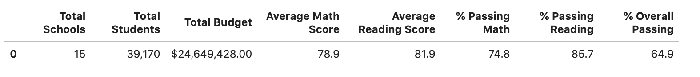
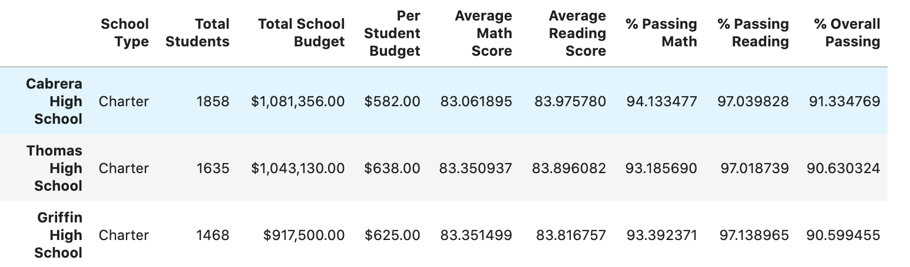
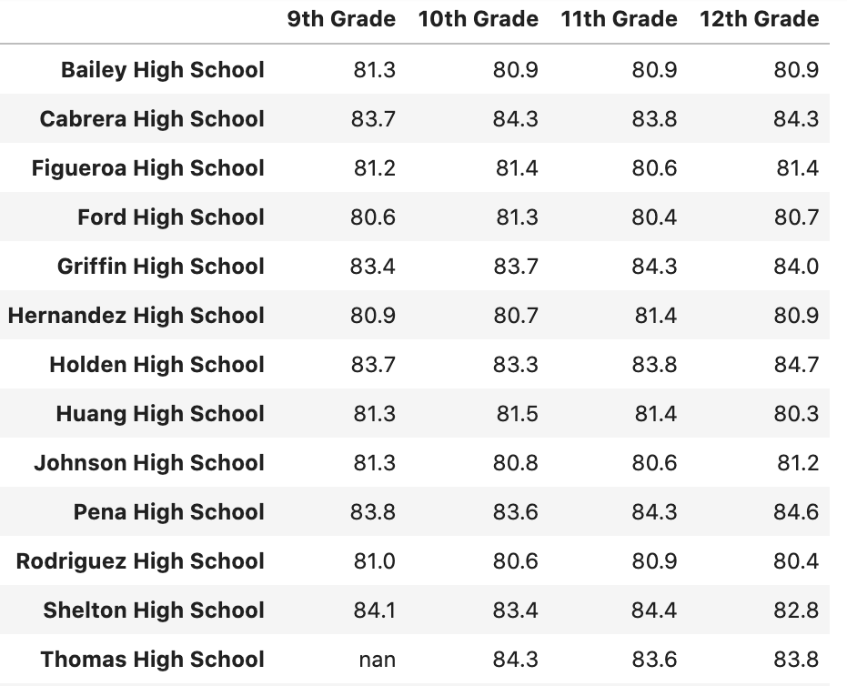
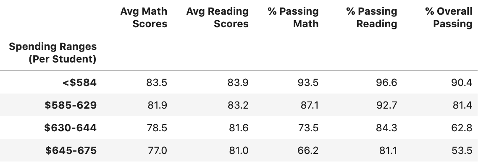
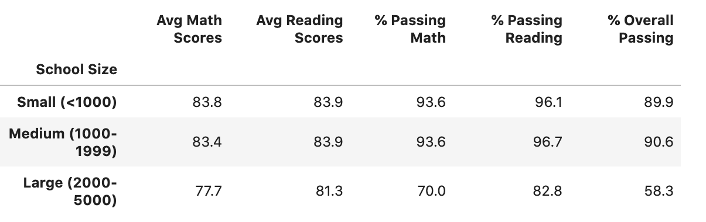
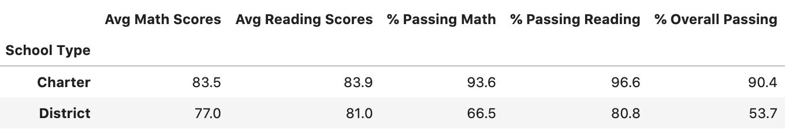

# School_District_Analysis
Reviewing school district data to understand trends in standardized test scores and school budgeting.

# Overview of School District Analysis
The purpose of this analysis is to understand how students attending schools within the district perform on standardized testing for reading and math relative to the student funding. 

After initial completion of the analysis, we learned that 9th grade class at Thomas High School may have been involved with some fraudulent test scores. This causes us to go back, strip out those test scores and re-analyze the data with our new data set.  Below are our findings from that new analysis.

# Results

### 1. How is the District Summary affected?
With removing the 9th grade class at Thomas High School, there were slight changes to the District Summary.  The average math and reading scores stayed the same but the overall pass %, the math pass %, and the reading pass % decreased by less than 1% in each category.

### 2. How is the school summary affected
The removal of 9th grade students at Thomas High School, didn't have much of an impact on the school summary since these changes only impacted one school on the list

### 3. How does replacing the ninth graders’ math and reading scores affect Thomas High School’s performance relative to the other schools?
The removal of 9th grader scores from Thomas High School caused the average score and passing percentages to both drop for math and reading. It also caused the Overall Passing % to drop for the school. All other high school metrics remained unchanged.

### 4. How does replacing the ninth-grade scores affect the following:
- Math and Reading scores by grade:

    In this summary, we see that all math and reading scores have been removed from the 9th grade column for Thomas High School.  The previous version showed 9th graders having a score of 83.7%.

- Scores by school spending:

For school spending, the statistics for each range remained unchange.  The 9th grade class is such a small piece of that total number, that the metrics did not change
- Scores by school size

Similar to school spending, the metrics remain unchanged.

- Scores by school type

- In the school type summary, we're bucketing schools into even larger categories so the removing of 9th grade isn't even noticeable when we re-run the data.

# Summary
To summarize this project, the removal of 9th grade scores from Thomas High School had minimal impact on the overall district analysis.  We see differences in math and reading average scores, % Passing Math and Reading and Overall Passing % when we look at District Summary, School Summary and Grade Level Summary.  But when we start to bucket schools into larger categories or bins, the impact the 9th grade scores make is negligible.